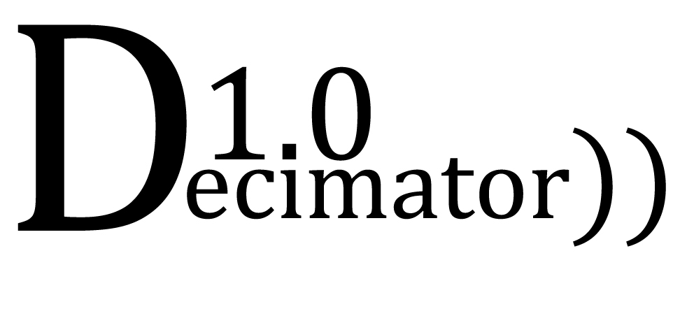

# Decimator 1.0:
Useful GUI interface to decimate large number of wav files from a certain folder to a certain sample rate (in kHz). The algorithm uses the function 'decimate' from the scipy package, in Python. It saves a new file adding "_XXkHz" as XX the new sample rate in a new folder called 'Downsampled'.

Link to download the app for free [here](https://drive.google.com/drive/folders/1fLrQGj4HPGcj-pr-LQZjMInBLl1F-g5t?usp=sharing).

